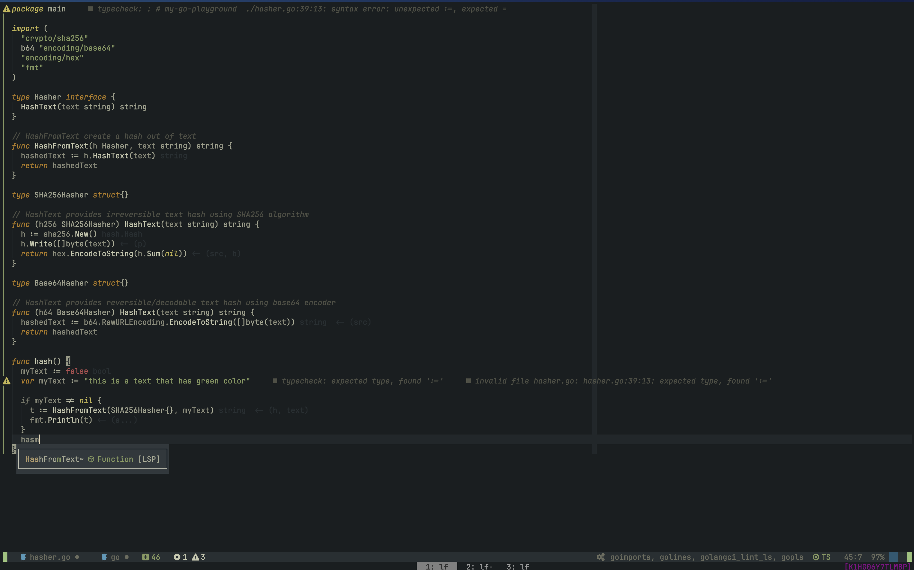

# Grail.nvim

Pleasant on eyes [grail](https://github.com/chama-chomo/grail) colour
scheme. 


## Screenshot



## Goals

- reducing color strain after enabling Treesitter highlighting
- warm colors
- suitable for long coding sessions during night

## Features

- 100% Lua, supports Treesitter & LSP
- Vim terminal colours

## Installation

Using [lazy.nvim](https://github.com/folke/lazy.nvim):

```lua
require("lazy").setup({
  "chama-chomo/grail",
  version = false,
  lazy = false,
  priority = 1000, -- make sure to load this before all the other start plugins
  -- Optional; default configuration will be used if setup isn't called.
  config = function()
    require("grail").setup({
      -- Your config here
    })
  end,
})
```

Using [packer.nvim](https://github.com/wbthomason/packer.nvim):

```lua
use({
  "chama-chomo/grail",
  -- Optional; default configuration will be used if setup isn't called.
  config = function()
    require("grail").setup()
  end,
})
```
